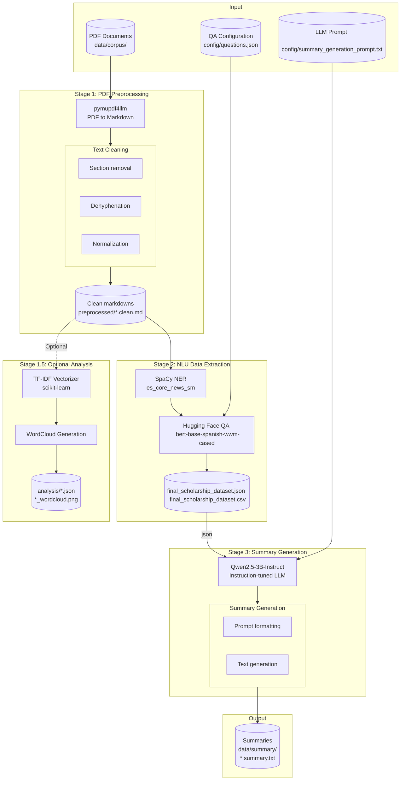

# System Architecture

## Overview

The system is organized into **two main pipelines** that work sequentially:

1. **Information Extraction Pipeline** (Stages 1 and 2): Transforms raw PDF documents into structured JSON data
2. **Text Generation Pipeline** (Stage 3): Converts structured data into human-readable summaries

The coupling point between both pipelines is the **structured JSON dataset** containing extracted scholarship information.

## Architecture Diagram

## Component Details

### Stage 1: PDF Preprocessing

**Module:** `utils/preprocessing.py`

**Purpose:** Convert PDF documents into clean, structured Markdown text suitable for NLP processing.

| Component | Technology | Description |
|-----------|------------|-------------|
| PDF Conversion | `pymupdf4llm` | Converts PDF to Markdown while preserving document structure |
| Text Cleaning | Custom regex | Removes page numbers, headers, footers, and irrelevant sections |
| Dehyphenation | Regex patterns | Merges words split across lines (e.g., "gene-\nral" → "general") |

**Input:** `data/corpus/*.pdf`

**Output:** `data/preprocessed/*.clean.md`

### Stage 1.5: Optional Analysis

**Module:** `utils/analysis.py`

**Purpose:** Perform TF-IDF term scoring analysis and generate word clouds for insights into document content. This stage is optional and provides additional analytical value but is not required for the main pipeline.

| Component | Technology | Description |
|-----------|------------|-------------|
| Tokenization | SpaCy (via Extractor) | Custom tokenizer with Spanish stopwords filtering |
| Term Scoring | `scikit-learn` TfidfVectorizer | Computes TF-IDF scores for each term per document |
| Visualization | `wordcloud` WordCloud | Generates PNG word clouds from top-scoring terms |

**Process:**
1. Normalize text using the Extractor's tokenizer
2. Build TF-IDF matrix across all documents
3. Extract top terms per document by score
4. Generate word cloud images for visual inspection

**Input:** `data/preprocessed/*.clean.md`

**Output:** 
- `data/analysis/*_analysis.json` - Term scores per document
- `data/analysis/*_wordcloud.png` - Visual word cloud images

### Stage 2: NLU Data Extraction

**Module:** `utils/extractor.py`

**Purpose:** Extract structured scholarship information using Named Entity Recognition and Question Answering models.

#### 2.1 Named Entity Recognition (NER)

| Component | Technology | Purpose |
|-----------|------------|---------|
| Model | SpaCy `es_core_news_sm` | Spanish NLP model |
| Task | Entity Recognition | Extract `ORG` entities for issuing body |

#### 2.2 Question Answering (QA)

| Component | Technology | Purpose |
|-----------|------------|---------|
| Model | `mrm8488/bert-base-spanish-wwm-cased-finetuned-spa-squad2-es` | Spanish QA model |
| Task | Extractive QA | Answer 27 predefined questions about scholarships |
| Configuration | `data/config/questions.json` | Question templates |

**Extracted Fields:**
- Academic year, target studies, deadlines
- Scholarship amounts (basic, income-linked, residence, variable, excellence)
- Income thresholds
- Special conditions (disability, insularity, victims)

**Input:** `data/preprocessed/*.clean.md` + `data/config/questions.json`

**Output:** Structured dictionary with 29 fields per document

### Stage 3: Summary Generation

**Module:** `utils/summarization.py`

**Purpose:** Generate human-readable article-style summaries from structured JSON data.

| Component | Technology | Description |
|-----------|------------|-------------|
| Model | `Qwen/Qwen2.5-3B-Instruct` | Multilingual instruction-tuned LLM |
| Prompt | `data/config/summary_generation_prompt.txt` | Instructions for article-style generation |
| Generation | Temperature: 0.3, Top-p: 0.9 | Controlled, deterministic output |

**Prompt Design:**
- Role: Public policy writer
- Format: 8-15 line article in Spanish
- Requirements: Cover all key fields without hallucination
- Constraints: No JSON mention, no bullet points

**Input:** `data/processed/final_scholarship_dataset.json`

**Output:** `data/summary/*.summary.txt`

## Technology Stack Summary

| Layer | Technologies |
|-------|-------------|
| **PDF Processing** | PyMuPDF, pymupdf4llm |
| **NLP - NER** | SpaCy (es_core_news_sm) |
| **NLP - QA** | Hugging Face Transformers, BERT (Spanish fine-tuned) |
| **Text Generation** | Qwen2.5-3B-Instruct, PyTorch |
| **Data Processing** | Pandas, scikit-learn (TF-IDF) |
| **Configuration** | JSON-based question templates, text prompts |

## Data Transformation Summary

| Stage | Input Format | Output Format | Key Transformation |
|-------|-------------|---------------|-------------------|
| 1. Preprocessing | PDF | Markdown | Document structure extraction |
| 2. Extraction | Markdown | Dictionary | Unstructured → Structured |
| 3. Generation | JSON | Plain Text | Structured → Natural Language |